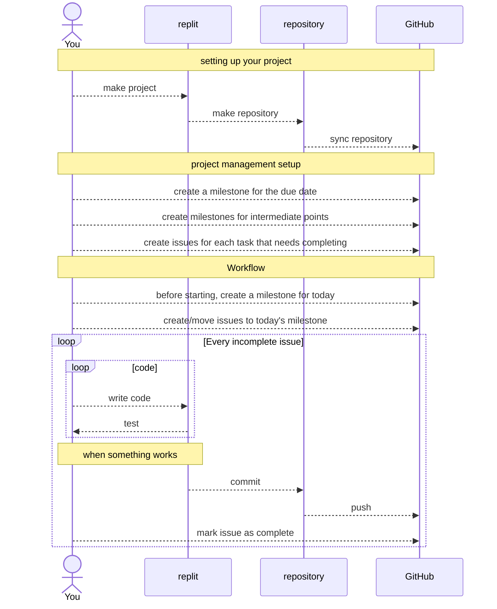

Project Management With GitHub
====

```mermaid
sequenceDiagram
    actor You
    participant replit
    participant repository
    participant GitHub
    Note over You,GitHub: setting up your project
    You -->> replit: make project
    replit -->> repository: make repository
    repository -->> GitHub: sync repository
    Note over You,GitHub: project management setup
    You -->> GitHub: create a milestone for the due date
    You -->> GitHub: create milestones for intermediate points
    You -->> GitHub: create issues for each task that needs completing
    Note over You,GitHub: Workflow
    You -->> GitHub: before starting, create a milestone for today
    You -->> GitHub: create/move issues to today's milestone
    loop Every incomplete issue
        loop code
            You-->>replit: write code
            replit-->>You: test
        end
        Note over You,replit: when something works
        replit-->>repository: commit
        repository-->>GitHub: push
        You-->>GitHub: mark issue as complete
    end
```
